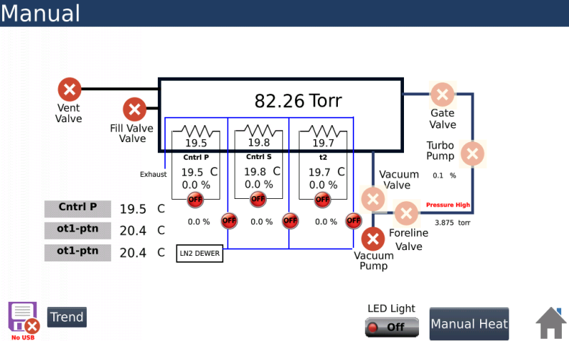

# GUI: architecture and requirements

Status: **Stages 0-3 built** (shared-file locking; login, status, plots, control and
the plan editor: `labcli gui`, docs/GUI.md); the rest is still planning. Written 2026-10-03, after step 2 (declared commands,
one-line plans, `labcli <command>`). Built so far: shared-file locking (Stage 0),
read-only server with login, status and plots (Stage 1), start/end/pause/resume and
commands with live suggestions (Stage 2), plan editor with cascading dropdowns (Stage 3).
Next: TVAC viewer.

## What it is

One small web application that runs on the bench machine and is used from a
browser. It is a *client* of what already exists; it never talks to an
instrument.

- **Plans:** edit and check `.plan` files.
- **Control:** start and end runs, send commands, see the state.
- **TVAC viewer:** valves, pumps and conditions of the chamber, live.
- **Space environment viewer:** orbit, eclipse, view factors, environment temperature.
- **Plot viewer:** temperatures and data from recorded runs.

## Decisions made

| | |
|---|---|
| Form | A web page, not a desktop window. Runs on Windows, Linux, Pi and Mac because they all have a browser. |
| Server | Python standard library only (`ThreadingHTTPServer`). No framework, no build step, no internet needed. |
| Page | Plain HTML, CSS and JavaScript files served as they are. |
| Access | The lab is locked, so a simple login is enough. Listens on `127.0.0.1` by default; reach it from another machine with an SSH tunnel. |
| Login | One username and password, kept in `~/.formslab/gui.json`, **not in source and not in this repo**. The initial values were given in conversation and are deliberately not recorded here. |
| Start | `labcli gui` (a new one-shot verb). |

## Principles

1. **One owner per instrument.** The HVC-3500 takes exactly one TCP client, and a
   Rigol or board should have one opener. The GUI server therefore never opens a
   driver. It reads CAST status blocks and files, and sends commands the same way
   the console does.
2. **No grammar of its own.** Dropdowns, validation and error text come from the
   existing grammar and plan parser (`rscripts.cast.complete`, `parse_plan`). A
   command typed in the console, a plan line and a GUI click are the same thing.
3. **The files are the truth.** Plans are plain `.plan` files; recorded runs are
   CSVs. The GUI saves and reads those; it keeps no database.
4. **Works with nothing running.** No host, no chamber, no orbit extra: each screen
   says what is missing and stays usable where it can.
5. **Read-only viewers.** Valve and pump *changes* happen on the Control screen,
   through the same commands as the console, so interlock refusals appear the same way.

## Architecture

```
 browser (any machine)                    bench machine
 ┌──────────────────┐   HTTP + login     ┌───────────────────────────────┐
 │ Plans            │ ◀──── JSON ──────▶ │ gui server (stdlib)           │
 │ Control          │   polls ~1 s       │   api.py: thin wrappers       │
 │ TVAC viewer      │                    └───┬───────────┬───────────────┘
 │ Space env / orbit│                        │ reads     │ writes
 │ Plots            │            CAST status │           │ CAST commands, ctrl,
 └──────────────────┘            run lock,   │           │ plan files
                                 CSVs, logs  ▼           ▼
                                      ┌──────────────────────────────┐
                                      │ sequence host (one per run)  │──▶ instruments
                                      └──────────────────────────────┘
```

- Live data is **polled once a second**. No websockets.
- The server is a separate process from the host, so a GUI crash cannot stop a run
  and a run ending does not close the page.
- All endpoints are thin: each calls an existing function and returns JSON.

### Endpoints (draft)

| Endpoint | Does | Reuses |
|---|---|---|
| `POST /login`, `POST /logout` | session cookie | new, small |
| `GET /api/status` | run state, every CAST block, host log tail | `ctrlcli.running`, castfile, `logcli` |
| `GET /api/plans`, `GET/PUT /api/plans/<name>` | list, read, save plan text | `plan.discover`, `find_plan` |
| `POST /api/plans/check` | plan text in, line-numbered errors out | `parse_plan` |
| `GET /api/complete?words=...` | what can come next, for a step or command | `cast.complete`, plan grammar |
| `POST /api/run`, `/api/end`, `/api/pause`, `/api/resume` | run control | `ctrlcli` |
| `POST /api/cast` | send a command, wait until it is taken | `cli._cast` logic |
| `GET /api/runs`, `GET /api/runs/<id>?vars=...` | recorded runs and their columns | recorder CSVs |
| `GET /api/env/...` | environment profile for the orbit view | `formslab.orbit` (lazy) |

## Screens and what each needs

### 1. Plans (editor)
- A list of step rows, each row a chain of dropdowns: step type or instrument, then
  words that fit, then number boxes showing limits and units.
- Every row is checked live by the real parser, with the error beside it.
- Save writes the plain text back, comments and blank lines kept.
- **Needs (not built):** a `plan_options(loaded_scripts, words)` function (the plan's
  `hold`, `until`, `log` completion exists inside the parser but is not exposed), and a
  test that parse, edit, save round-trips every shipped plan unchanged.

### 2. Control
- Run state, Start (plan list), End (always visible), Pause and Resume.
- A command box with the same `?` completion as the cast tab; refused with a clear
  message when no run is going (as `labcli cast` does).
- Live CAST blocks for `hvc`, `tc`, `psu1`, `psu2`, `cryo`, `slta`.

### 3. TVAC viewer (valves and conditions)

Follow the controller's own Manual screen so operators see the picture they already
know: [Notebook/tvac-chamber.md](tvac-chamber.md) has the screenshot and the
chamber's description.



Layout to reproduce (one SVG, values filled in from CAST):

- **Chamber box**, large, with the pressure reading on it.
- **Gas side, left:** Vent Valve and Fill Valve into the chamber.
- **Vacuum side, right:** Gate Valve to the Turbo Pump, Vacuum (rough) Valve to the
  Vacuum Pump, and the Foreline Valve between them.
- **Three zone blocks inside:** Cntrl P (platen), Cntrl S (shroud), t2 (zone 3,
  monitor only), each with temperature, a heater output percentage, and an ON/OFF
  indicator.
- **Side readouts:** the named thermocouples, and the LN2 dewar label.
- **Banner:** faults (the screen shows "Pressure High" by the foreline).

What each item on the screen is in our software, and whether we can show it today:

| On the screen | Our name / source | Available now? |
|---|---|---|
| Chamber pressure (82.26 Torr) | `pressure`, `?VP` | yes |
| Vent, Fill, Foreline, Gate valves | `vent`, `fill`, `foreline`, `gate` (`!OV/OF/O4/OG`) | yes, open or closed |
| "Vacuum Valve" | `rough` (`!OR`) | yes |
| Vacuum Pump, Turbo Pump | `pump`, `turbo` (`!OP/OT`) | yes, on or off |
| Zone temperatures (19.5, 19.8, 19.7 C) | `<zone> C`, thermocouples T2, T3, T4 | yes |
| Zone ON/OFF | `thermal_control` | yes |
| Zone setpoint | `<zone> setpoint C` | yes |
| Side readouts (Cntrl P, ot1-ptn, ...) | named thermocouples `HVC_...` | yes. The HMI labels both lower rows "ot1-ptn"; the profile maps T0 and T1 to `ot1_ptn` and `ot2_shd`, so the second is presumably `ot2-shd` |
| Fault banner | `faults`, `fault_severity` | yes |
| **Heater output %** (0.0 % per zone) | no documented query | **not read** |
| **Turbo speed %** (0.1 %) | no documented query | **not read** |
| **Foreline pressure** (3.875 torr) | a fault code exists (25), no query known | **not read** |
| LED Light, Manual Heat, Trend | HMI-only controls | no; Trend is replaced by the Plot viewer |

So the viewer can be built now with the first group, and the three "not read" items
are shown as unavailable until we find where the controller exposes them (an ASCII
query, or one of the temperature or register inputs). Finding them is a small
commissioning task, not GUI work.

Icon states on the screen (red X versus the pale pink icons) need decoding against
live observation: the screenshot shows everything closed or off, with some icons
drawn faded.

Other needs:

- Shows "no run" or "chamber unreachable" instead of stale numbers; every value
  carries its age.

### 4. Space environment and orbit viewer
- Orbit geometry, beta angle and eclipse timeline, view factors over the orbit, and
  environment temperature versus time, from `formslab.orbit`.
- **Constraint:** `formslab.orbit` needs numpy, scipy and matplotlib (the `orbit`
  extra). The server imports it lazily and the screen says so when it is absent.
- **Heavy work stays out of requests.** A profile is computed once, cached as JSON, and
  the page draws it. Drawing is 2D in the browser.
- **Open:** `orbit` has a 3D scene (`scene3d`) built on plotly, which is a multi-MB
  script. Offline and "simple" argue for leaving it out of the first version.
- **Dependency gap:** nothing yet *replays* a profile against the chamber (no plan step
  for it). Until there is, this screen is a standalone orbit view; showing "where the
  run is in the profile" waits for that step.

### 5. Plot viewer
- Pick one or more recorded runs, pick variables, plot against time; overlay runs;
  zoom and pan; Celsius or Kelvin; export the picture or the CSV.
- **Data:** the run recorder writes `<plan>_<UTC>.csv` with columns
  `index, timestamp, <name> [<unit>]`. A run that gains a variable mid-run starts a
  new file (`_1`, `_2`).
- **Live plots lag by the record cadence** (30 s for `tvac`). Faster live plotting would
  need the host to keep recent values in memory; deferred.
- **Old files differ:** the `TVAC_*.csv`, `pumpdown_*.csv` and `LACO.jsonl` in
  `outputs/` have other layouts. The viewer should read the recorder format first and
  list the others as unsupported rather than guess.
- **Plot library:** the one third-party file I'd allow is a vendored `uPlot` (small,
  fast, MIT; license to be confirmed before it goes in the repo). A hand-written canvas
  chart is the fallback if no third-party file is wanted.

## Login and safety

- A session cookie after logging in; credentials compared in constant time; a short
  delay after failed attempts. Plain HTTP is accepted: the lab is locked and the
  default is localhost behind an SSH tunnel.
- Listening beyond `127.0.0.1` is an explicit option (`labcli gui --listen`), off by
  default.
- GUI logins and actions are logged to `~/.formslab/.run/gui.log` with the user name
  (the host owns its own log, so the GUI cannot write there; per-command names inside
  the host would need a change to the CAST request format).
- Note: the password chosen is also the PowerSwitch fallback password. Fine for a
  locked lab, but worth separating later.
- Writes are limited to the plans folder; the server cannot save elsewhere.

## Layout in the repo (proposed)

```
src/formslab/gui/
    server.py        routes, login, static files
    api.py           wrappers over existing functions (testable without a server)
    static/          index.html, app.js, style.css, (uplot.min.js)
test/test_gui_api.py        api functions called directly
test/test_gui_server.py     one real server on a free port, driven with http.client
```

`static/` must ship as package data (the Pico firmware already does this).

## Requirements

Functional
- F1 Edit, check and save a plan with line-numbered errors, from dropdowns.
- F2 Start, end, pause and resume a run; send any cast command.
- F3 Live valves, pumps, pressure and temperatures with the age of each value.
- F4 Plot any recorded run's variables, overlaid, with zoom.
- F5 Orbit, eclipse, view factor and environment temperature view (when the extra is installed).
- F6 Log in and out; unauthenticated requests get nothing.

Non-functional
- N1 Runs on Windows, Linux (Pi included) and, ideally, Mac; any current browser.
- N2 No build step, no internet, no new base dependency (the orbit extra stays optional).
- N3 Does not open any instrument, ever.
- N4 Usable with no host running (plans, plots, orbit view still work).
- N5 A page reload loses nothing: state lives in files.
- N6 Small enough to read in an afternoon: roughly 150 lines of server, a few hundred of page per screen.

## Build order (each stage useful alone)

1. Server skeleton, login, status, run and end, Control screen.
2. Plans editor (plus `plan_options` and the round-trip test).
3. TVAC viewer.
4. Plot viewer.
5. Space environment viewer (after deciding the 3D and replay questions).

## Open questions

1. ~~Chamber schematic~~ -- settled 2026-10-03: follow the HMI Manual screen (section 3).
2. Orbit view: 2D only at first, or is 3D needed from the start?
3. Should a plan be able to *replay* an orbit profile against the chamber (a new plan
   step), and should the orbit screen then show the run's position in it?
4. Two people editing the same plan: warn on conflicting saves, or last save wins?
5. Celsius or Kelvin as the default display? (Values are published in K internally.)
6. Do students need to *start* runs from the GUI, or only edit plans and watch?
7. Heater output %, turbo speed % and foreline pressure are on the HMI but not read by our
   software: worth finding where the controller exposes them?
